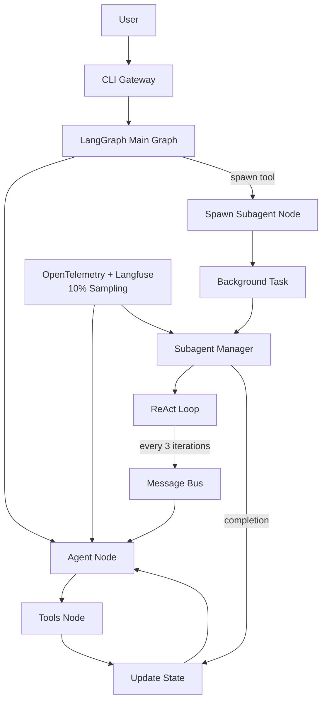
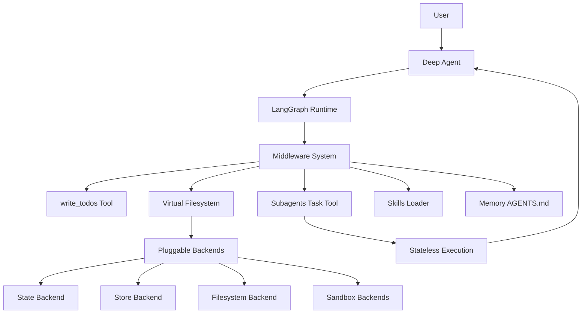

# LangGraph vs DeepAgents: Feature Comparison

## Executive Summary

| Aspect | Nanobot (Custom LangGraph) | LangChain DeepAgents |
|--------|---------------------------|----------------------|
| **Approach** | Custom implementation (~4k LOC) | Framework harness (30k+ LOC) |
| **Philosophy** | Lightweight, full control | Batteries-included, quick start |
| **Best For** | Resource-constrained, custom observability | Complex tasks, production-ready |

---

## Feature Comparison Matrix

| Feature | Nanobot | DeepAgents | Winner |
|----------|---------|------------|--------|
| **Agent Loop** | Custom ReAct (manual) | Built-in ReAct (automated) | DeepAgents |
| **Planning** | None | `write_todos` tool | DeepAgents |
| **Subagents** | Background tasks with async adjustments | Stateless via `task` tool | Tie |
| **Context Mgmt** | Last 10 messages | Auto-compression (offload + summarize) | DeepAgents |
| **Filesystem** | Nanobot Registry | Virtual filesystem (6 tools) | DeepAgents |
| **Observability** | Custom OTEL + Langfuse (10% sampling) | None (add manually) | Nanobot |
| **Skills/Memory** | Message Bus only | Skills + Memory (AGENTS.md) | DeepAgents |
| **Code Execution** | Custom tools | Sandbox backends (Modal, Daytona) | DeepAgents |
| **Human-in-the-loop** | Message requests | `interrupt_on` parameter | DeepAgents |
| **Long-term Memory** | File-based (optional) | LangGraph Store integration | DeepAgents |
| **Pluggable Backends** | Nanobot providers only | 7+ backend types | DeepAgents |
| **Dependencies** | Minimal (2) | Heavy (5+) | Nanobot |
| **Learning Curve** | High | Low | DeepAgents |
| **Production Ready** | Manual testing needed | Framework-tested | DeepAgents |

---

## Architecture Comparison

### Nanobot Architecture



### DeepAgents Architecture



---

## Code Examples

### Creating an Agent

**Nanobot:**
```python
from nanobot.langgraph.graph.main_graph import create_main_graph
from langgraph.checkpoint.memory import MemorySaver

config = {...}
graph = create_main_graph(config)
compiled = graph.compile(checkpointer=MemorySaver())
```

**DeepAgents:**
```python
from deepagents import create_deep_agent

agent = create_deep_agent(
    tools=[my_tool],
    system_prompt="You are helpful"
)
```

### Spawning a Subagent

**Nanobot (Agent initiates):**
```python
# LLM generates spawn tool call
tool_calls = [
    {
        "name": "spawn",
        "args": {
            "task": "Research X",
            "label": "researcher"
        }
    }
]
# Background task created with initial context (last 10 messages)
```

**DeepAgents (Agent initiates):**
```python
# LLM uses task tool
agent.invoke({
    "messages": [{
        "role": "user",
        "content": "Use task tool to research X"
    }]
})
# Fresh agent instance runs to completion
```

### Observability

**Nanobot (Built-in):**
```python
from nanobot.langgraph.observability.opentelemetry import setup_tracer

tracer = setup_tracer(service_name="my-agent")
# 10% sampling, OTEL export, file metrics
```

**DeepAgents (Manual):**
```python
from langchain.callbacks.tracers import LangChainTracer

tracer = LangChainTracer()
# Need to add manually
```

---

## When to Choose Which

### Choose Nanobot When:
- ✅ Minimal dependencies required
- ✅ Full control over architecture
- ✅ Custom observability critical
- ✅ Already using Nanobot ecosystem
- ✅ Resource-constrained environments
- ✅ Need async adjustments between agents

### Choose DeepAgents When:
- ✅ Want quick start with batteries-included
- ✅ Need sophisticated context management
- ✅ Require pluggable backends (sandboxes, stores)
- ✅ Want built-in planning & task decomposition
- ✅ Need skills/memory system
- ✅ Want human-in-the-loop approval
- ✅ Need long-term memory across threads

---

## Key Differences

| Aspect | Nanobot | DeepAgents |
|--------|---------|------------|
| **Subagent Communication** | Async adjustments via Message Bus | Stateless, single result |
| **Context Transfer** | Last 10 messages | Full context compression |
| **Observability** | 10% sampling + OTEL + Langfuse | None (add manually) |
| **Planning** | Manual | Built-in `write_todos` |
| **Persistence** | MemorySaver (in-memory) | Multiple backend options |
| **Customization** | Full control | Middleware-based |

---

## Conclusion

**DeepAgents** is feature-rich and production-ready but heavy. Best for complex agents needing planning, context management, and built-in features.

**Nanobot** is lightweight and customizable. Best for controlled environments with custom observability needs and resource constraints.

**Recommendation:** For Nanobot's use case, continue with custom LangGraph and consider integrating DeepAgents selectively for complex planning tasks.
